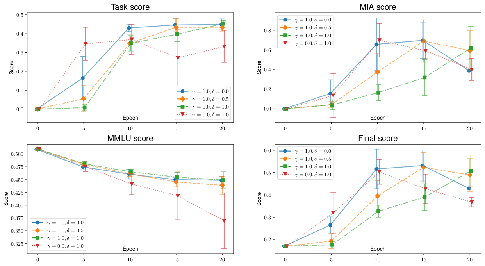

# LLM Unlearning using Parameter-efficient Finetuning

[](https://arxiv.org/abs/2503.13690)


This repository contains the solution to the [SemEval-2025 Task 4 on Unlearning sensitive content from Large Language Models](https://llmunlearningsemeval2025.github.io)

### Directory structure:
- [src/](src/): source code of our solution
- [jobs/](jobs/): OpenPBS compatible scripts we used to run experiments
- [semeval/submissions/](semeval/submissions/): the concrete scripts submitted to the challenge. 

## Experimental results


## Setup

Using [uv](https://docs.astral.sh/uv/) (recommended):
```bash
uv sync
```

The `requirements.txt` file is also present for pip setup.

## Running the project
Disclaimer: At the moment, the evaluation scripts are not included in the repository. We are currently rewriting them to release them under the MIT license.

All available arguments may be listed using:
```bash
uv run src/unlearn.py --help
```

Important arguments:
```bash
  --model {1B,7B}       Model to use.
  --logdir LOGDIR       Logdir.

  --batch_size BATCH_SIZE
                        Batch size.
  --epochs EPOCHS       Number of unlearning epochs.
  --learning_rate LEARNING_RATE
                        Learning rate.
  --beta BETA           Beta for NPO loss.
  --npo_mult NPO_MULT   NPO forget loss multiplier.
  --rt_mult RT_MULT     NLL retain loss multiplier.
  --kl_mult KL_MULT     KL divergence retain loss multiplier.
  --lora_rank LORA_RANK
                        Rank of the LoRAs.
  --lora_alpha LORA_ALPHA
                        The LoRA alpha parameter. None means alpha=rank.
  
  --evaluate_every EVALUATE_EVERY
                        Currently has no effect.
  --save_every SAVE_EVERY
                        Save checkpoint every n epochs. `-1` means never.
  --save_model, --no-save_model
                        Save model after training.
```
